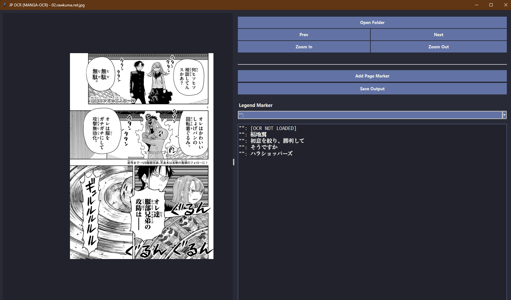

# [JP_OCR - Extened use of Manga OCR]

**[JP_OCR]** is a powerful GUI tool designed for quickly performing Optical Character Recognition (OCR) on images, with a special focus on manga and comics. It allows users to select regions of an image, run high-accuracy OCR, and collect the text for translation, annotation, or data collection.



---

## Features

- **Folder-Based Workflow:** Easily open and navigate through a folder of images (`.jpg`, `.png`, `.webp`, etc.).
- **Interactive Image Viewer:** Pan the image with the middle mouse button and zoom with Ctrl+Scroll for precise selection.
- **Region Selection:** Simply click and drag to select the exact text region you want to process.
- **High-Accuracy Manga OCR:** Powered by the `manga-ocr` engine, which is specifically trained on Japanese manga for superior accuracy.
- **Custom Legends:** Prepend text lines with customizable markers (e.g., `OT:`, `Sfx:`, `"":`) to categorize the extracted text.
- **Page Markers:** Insert `page1`, `page2`, etc. markers with a single click to structure your final output file.
- **Save Your Work:** Export all collected text into a single, clean `.txt` file.
- **Modern UI:** A clean, themed, and intuitive user interface.

---

## How to Use

If you want to run or modify the source code, follow these steps.

The Easier way:
1.  **Clone the repository:**
    ```sh
    git clone https://github.com/MAHlRU-SHIINA/Jp_OCR-extension-to-MangaOCR.git
    cd Jp_OCR-extension-to-MangaOCR
    ```
2.  **Run Setup.bat file**
    ```Sh
    Double click the setup.bat file
    ```
3.  **Run a Shotcut created on desktop**

Or the DEV way: 
1.  **Clone the repository:**
    ```sh
    git clone https://github.com/MAHlRU-SHIINA/Jp_OCR-extension-to-MangaOCR.git
    cd Jp_OCR-extension-to-MangaOCR
    ```

2.  **Create a Python virtual environment:**
    ```sh
    python -m venv venv
    venv\Scripts\activate
    ```

3.  **Install the required libraries:**
    ```sh
    pip install -r requirements.txt
    ```

4.  **Run the application:**
    ```sh
    python JP_OCR.py
    ```

**Acknowledgments**
This tool is made possible by the incredible work of the open-source community, especially:
The manga-ocr project for its high-quality OCR engine.
The developers of PyInstaller, Pillow, and NumPy.

